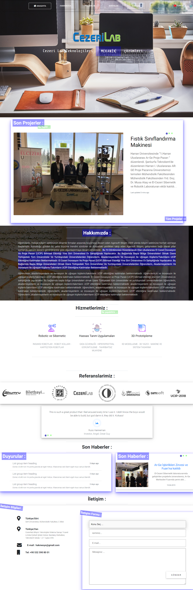

 CezeriLab-WebSite 

Bootstrap 4 Based  , Frontend of CezeriLab Company Website     

Geliştirme ortamı : Visual Studio Code  
Teknolojiler :  
   •	Bootstrap 4 : tasarım class’ları üzerine ihtiyaca göre bir şeyler ekleyerek kullanılmıştır.   
   •	Mdbootstrap : Material Design ve Bootstrap birleşiminden oluşan Mdbootstrap bazı özelliklerinden faydalanmıştır. 
   •	Jquery : Sayfada etkileşimli efektleri sağlamak için kullanılmıştır.   
Araçlar ve kütüphaneler : 
   •	particles.js : sitenin arka planına hareketli nesneler oluşturmak için kullanılan açık kaynaklı kütüphanedir. 
   •	aos.js : sayfaya geçiç effekleri eklemek için kullanılan açık kaynaklı kütüphanedir. 
   •	WebGradients.com :  arka planın renk stilini gradyan renk olarak ayarlamak için. 
   •	CssReference.com : css komutları resimli ve canlandırılmış örneklerle açıklayan Css rehberidir. 
   •	hackerthemes.com : bootstrap tüm classları örneklerle açıklayan bir web sitedir. 
   •	hexcolortool.com : rgba renkleri oluşturup görmek için kullanılan bir web sitedir.  

Kullanılan kütüphaneler CDN bağlantısı olarak projeye dâhil edilmiştir.  

https://hasannaser.github.io/design-of-CezeriLab-WebSite/cezeriLAB/Home.html

demo görünüm :

and it is best way to do it. 
